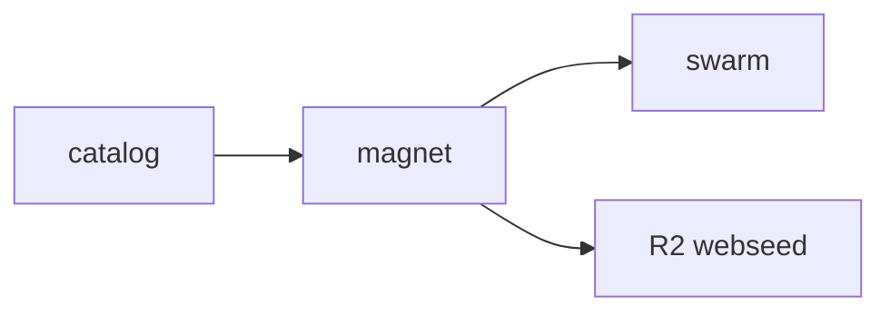

# Model Torrent

[](https://github.com/modeltorrent-foundation/mt/actions/workflows/ci.yml)

BitTorrent meets Hugging Face. Open-weight models, content-addressed. A hub nobody can buy.

**Catalog** — [modeltorrent.org](https://modeltorrent.org/)
**Source** — [github.com/modeltorrent-foundation/mt](https://github.com/modeltorrent-foundation/mt) · [codeberg.org/modeltorrent-foundation/mt](https://codeberg.org/modeltorrent-foundation/mt)



```bash
GOTOOLCHAIN=auto go install github.com/modeltorrent-foundation/mt/cmd/mt@latest
```

```bash
mt get Qwen/Qwen2.5-0.5B-Instruct-GGUF
```

A real catalog model. Seeding stays on after download (`--no-seed` for a one-shot). You do not need our VPS — [run your own seeder](./docs/run-your-own-seeder.md).

Weights verify against a signed manifest. The HTTP webseed is an accelerator, never a trust root.

Software is [AGPL-3.0-or-later](./LICENSE). Catalog metadata is [CC0-1.0](./CATALOG-LICENSE). Each weight keeps its publisher SPDX.

Bootstrap domain: [modeltorrent.org](https://modeltorrent.org/). Mirrors: [modeltorrent.pages.dev](https://modeltorrent.pages.dev/), [modeltorrent-foundation.github.io/mt](https://modeltorrent-foundation.github.io/mt/). Catalog git mirror: [codeberg.org/modeltorrent-foundation/mt](https://codeberg.org/modeltorrent-foundation/mt) ([docs/codeberg-mirror.md](./docs/codeberg-mirror.md)). Design: [SCOPE.md](./SCOPE.md). Governance: [GOVERNANCE.md](./GOVERNANCE.md).

## Dev

Tiny fixtures, a local catalog, and web demo magnets:

```bash
export GOTOOLCHAIN=auto
make fixtures
make build
MT_CATALOG=web/catalog.json ./bin/mt get demo/tiny-gguf ./downloads/demo/tiny-gguf
cd web && python3 -m http.server 8080
```
